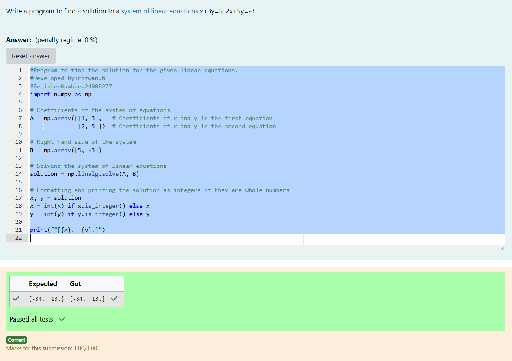

# -SOLUTION-TO-A-SYSTEM-OF-LINEAR-EQUATIONS
## Aim:
To write a python program to find a solution to a system of linear equations.
## Equipment’s required:
1. 	Hardware – PCs
2. 	Anaconda – Python 3.7 Installation / Moodle-Code Runner
## Algorithm:
### Step 1: 
Import the numpy module to use the built-in functions for calculation
### Step 2: 
Prepare the lists from each linear equations and assign in np.array()
### Step 3: 
Using the np.linalg.solve(), we can find the solutions.
### Step 4: 
End the program
## Program:

    #Program to find the solution for the given linear equations.
    #Developed by:rizwan.b 
    #RegisterNumber:24900277
    import numpy as np

    # Coefficients of the system of equations
    A = np.array([[1, 3],   # Coefficients of x and y in the first equation
                [2, 5]])  # Coefficients of x and y in the second equation

    # Right-hand side of the system
    B = np.array([5, -3])

    # Solving the system of linear equations
    solution = np.linalg.solve(A, B)

    # Formatting and printing the solution as integers if they are whole numbers
    x, y = solution
    x = int(x) if x.is_integer() else x
    y = int(y) if y.is_integer() else y

    print(f"[{x}.  {y}.]")

## Output:

## Result: 
Thus the solutions for the linear equations are successfully solved using python program

